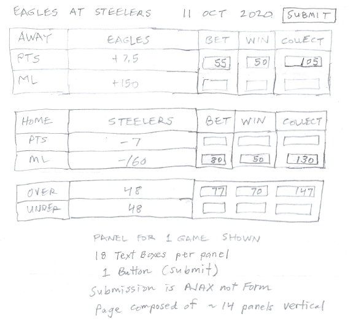

## Sports Wagering Technical Reference 

An informal and frequently changing container for policy, requirements, design notes, sketches, etc.
in order to help out with building this thing.

### Team members

- Madeline Rys
- Christian Wettre
- Mahima Chandan
- Dale Pippert
- Amrutha Ravi

### GitHub URLs

#### Sports wagering project site

<a href="https://github.com/madelinerys/CS546-Final-Project">
https://github.com/madelinerys/CS546-Final-Project</a>

#### Sports wagering project proposal 

<a href="https://github.com/madelinerys/CS546-Final-Project/blob/main/doc/ProjectProposalSportsWagering.pdf">
https://github.com/madelinerys/CS546-Final-Project/blob/main/doc/ProjectProposalSportsWagering.pdf
</a>

#### Sports wagering database proposal

<a href="https://github.com/madelinerys/CS546-Final-Project/blob/main/doc/DatabaseProposalSportsWagering.pdf">
https://github.com/madelinerys/CS546-Final-Project/blob/main/doc/DatabaseProposalSportsWagering.pdf
</a>

#### Sports wagering technical reference (this document) 

<a href="https://github.com/madelinerys/CS546-Final-Project/blob/main/doc/TechnicalReferenceSportsWagering.md">
https://github.com/madelinerys/CS546-Final-Project/blob/main/doc/TechnicalReferenceSportsWagering.md
</a>

<h2>Work breakdown philosophy</h2>

Thoughts I have is that it's best to have each team member take on a particular feature
in a "full stack" manner meaning they are responsible for user interface,
the Express routes, and getting whatever data is needed in and out of Mongo. I think working
at a distance with a short calendar this has the best chance of success. Team members can
work mostly independently on their piece initially. Comments? 

We would then identify the main pieces of functionality and team members would volunteer
what they want to take on.

<h2>Technologies</h2>

I believe he covers Bootstrap in the weeks ahead. Never used personally. However it may offer
needed assistance for the "responsive" requirement. So I was going to propose we stick to:

- Bootstrap (which brings with it jQuery and Popper whether you want them or not)
- Node.js and Express (no choice)
- Axios (needed for API to sports information)
- Mongo (no choice)
- HTML (no choice)
- Javascript (no choice)
- CSS (no choice)

I'm proposing we stay away from front-end frameworks such as React/Angular. Not enough time
for me/us to learn these technologies. If we go down in flames we should do it with technologies
that are covered in the class, if for no other reason hopefully the professor shows
some empathy.

<h2>Betting panel</h2>

Users would be directed straight here after login. This is where they make their bets.

<h3>Initial sketch</h3>

<h3>Betting panel operation</h3>

1. Submit button enables only when one or more of the 12 text boxes contains
a non-zero amount, and is disabled otherwise.

1. For each of the six Bet/Win rows, a non-zero amount may be entered in only
_one_ of the two text boxes in that row. The empty text box must be disabled.
Both text boxes should be enabled when they are both empty.

1. All text to left of Bet/Win columns is either static to the template page
or static as rendered from the database. User cannot change this static text.

1. User will be prompted after pressing Sumbit, e.g., "You are about to wager
$420 on this game. Are you sure?" Y/N buttons.

1. User will receive confirmation once Submit has sucessfully processed on the
backend by insert bet into Bets collection. User's balance will deduct by
amount of wager. Confirmation can be
as simple as "Your wager totalling $420 is in!" Perhaps it is some type of
popup with buttons *Continue* and *Logout* on it.

    a. Pressing *Continue* will dismiss confirmation box and return user to
the betting screen.

    b. Pressing *Logout* will log the user out and return application to
the login screen ready for the next customer.

    c. Perhaps we change Submit button to *Start Again* so that user does
not get confused and try to Submit bets a second time.

1. Submit must occur by AJAX callback so as to a) meet requirement of
the project per professor and 2) so that screen does not have to flash as
it reloads all 14 panels (one panel per game). The AJAX call should only
result in the current panel refreshing.

1. Panel is shown in its already smallest dimension with only one panel
stationed horizontally per row. On larger screens the panels should to
some extent "unstack" and start to appear horizontally, perhaps two or
three of them will fit horizontally. This is to demonstate that our application
is *responsive* which is another requirement.

1. This page has 14 panels, one for each game for that week. Panels are
arranged responsively but on a small screen they would stack vertically one
after the other with comfortable space between each. A drop down where you
would first select one of 14 games then only that panel appears does not
feel right to me which is why I want all 14 panels to display at once. Bettors
need to be able to see in one fell swoop what the lines are, what looks appealing
to bet on, and what they have already bet on.

<h2>Summary</h2>

More to come eventually but wanted to get something down on paper and out to the group. 
